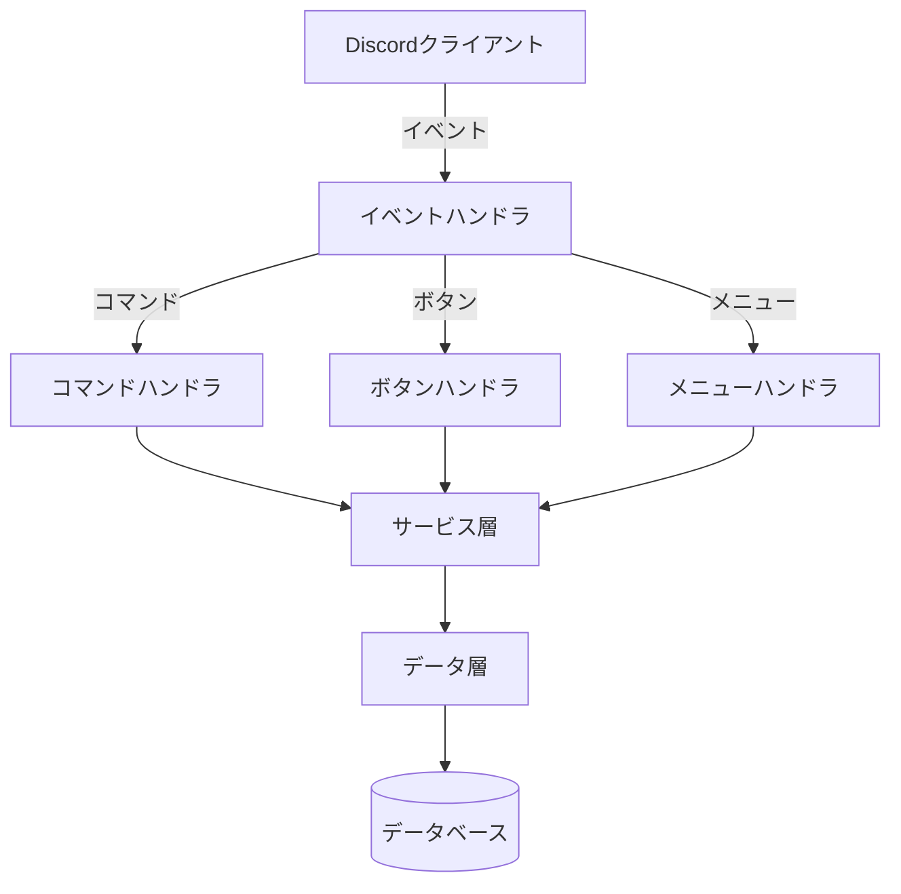

# Infinity LT Manager Discord Bot
無限LT会を管理するDiscordボット

## 機能概要
- LTの登録・編集・管理
- 次回発表者自動通知
- LT会開始管理

## セットアップ
1. 依存関係をインストール:
```bash
bun install
```

2. 環境変数を設定 (.envファイルを作成):
```env
DISCORD_TOKEN=your_bot_token
ADMIN_USER_ID=your_admin_user_id
DATABASE_URL=your_database_url
...
```

3. ボットを起動:
```bash
bun run dev
```

4. コマンドを登録:
```bash
bun run register
```

## 利用可能なコマンド
### ユーザーコマンド
- `/register-lt [title] [ready] [description]` - LTを登録
- `/edit-lt` - 登録済みLTを編集

### 管理者コマンド
- `/next-lt [limit]` - 次回のLT発表者を通知 (管理者専用)
- `/start-lts` - LT会を開始 (管理者専用)

## 開発
### スクリプト
- `bun run dev` - 開発モードで起動
- `bun run register` - コマンドを登録
- `bun run delete` - コマンドを削除
- `bun run prisma-fmt` - Prismaスキーマをフォーマット

### 技術スタック

#### 主要技術
- [Bun](https://bun.sh/) v1.0 - JavaScriptランタイム (代替: Node.js)
- [TypeScript](https://www.typescriptlang.org/) v5.0 - 静的型付け言語
- [Discord.js](https://discord.js.org/) v14.17 - Discord APIクライアントライブラリ
- [Prisma](https://www.prisma.io/) v6.2 - ORM (データベース操作)
- [Zod](https://zod.dev/) v3.24 - スキーマバリデーション

#### アーキテクチャ概要


# プロジェクトディレクトリ構成

## 主要ディレクトリと役割

```
src/
├── buttons/          # Discordボタンインタラクション処理
├── commands/         # スラッシュコマンド実装
├── eventHandlers/    # Discordイベントハンドラ
├── services/         # 主要ビジネスロジック
├── stringSelectMenus/ # セレクトメニュー処理
├── tables/           # データモデル定義 (Prismaスキーマ)
├── types/            # 型定義
```

## データモデル

### LightningTalk (LT情報)
- `id`: 自動採番ID
- `speaker`: 発表者名
- `title`: LTタイトル
- `description`: LT説明 (デフォルト: 空文字)
- `state`: LT状態 (UNREADY/READY/DOING/DONE)
- `priority`: 優先度 (デフォルト: 0)
- `createdAt`: 作成日時
- `updatedAt`: 更新日時
- `notificationMessage`: 通知メッセージとのリレーション
- `nextLightningTalk`: 次回LT情報とのリレーション

### State (LT状態)
- `UNREADY`: 準備未完了
- `READY`: 準備完了
- `DOING`: 発表中
- `DONE`: 発表完了

### NotificationMessage (通知メッセージ)
- `id`: 自動採番ID
- `messageId`: DiscordメッセージID (ユニーク)
- `lightningTalk`: LT情報とのリレーション
- `lightningTalkId`: LT情報ID (ユニーク)
- `createdAt`: 作成日時
- `updatedAt`: 更新日時

### NextLightningTalk (次回LT情報)
- `id`: 自動採番ID
- `lightningTalk`: LT情報とのリレーション
- `lightningTalkId`: LT情報ID (ユニーク)
- `order`: 発表順序 (ユニーク)
- `done`: 発表完了フラグ (デフォルト: false)
- `createdAt`: 作成日時
- `updatedAt`: 更新日時

## 開発ガイド

### データモデル管理

1. スキーマ編集:
   - `prisma/schema.prisma` を編集
   - モデル定義やリレーションを変更

2. マイグレーション作成:
   ```bash
   bunx prisma migrate dev --name "変更内容の説明"
   ```

3. クライアント生成:
   ```bash
   bunx prisma generate
   ```

4. スキーマフォーマット:
   ```bash
   bun run prisma-fmt
   ```

### ディレクトリの役割

- `src/services/`: アプリケーションビジネスロジック
  - Discord連携やフロー制御など、アプリケーション固有の処理
  - 例: LT登録時の通知処理、状態管理

- `src/tables/`: エンタープライズビジネスロジック
  - データベース操作 (Prismaクライアントを使用したCRUD)
  - データ整合性チェックやトランザクション管理

- `prisma/`: データモデル定義
  - `schema.prisma` にデータベーススキーマを定義
  - `bunx prisma generate` で型を自動生成

### アプリケーション全体の処理フロー

1. 起動処理 (`src/index.ts`):
   - Discordクライアントの初期化
   - 環境変数の読み込み (`src/env.ts`)
   - イベントハンドラの登録
   - コマンド/ボタン/メニューの登録

2. イベント処理 (`src/eventHandlers/`):
   - `clientReadyHandler.ts`: ボット起動時の初期化処理
   - `interactionCreateHandler.ts`: ユーザーインタラクションの振り分け
     - コマンド受信 → 該当コマンドへルーティング
     - ボタンクリック → 該当ボタンハンドラへルーティング
     - セレクトメニュー → 該当メニューハンドラへルーティング

3. コマンド処理 (`src/commands/`):
   - スラッシュコマンドのパラメータ検証
   - サービス層への処理委譲
   - レスポンスの構築

4. サービス層 (`src/services/`):
   - アプリケーション固有のビジネスロジック
   - Discord APIとの連携
   - データ層の呼び出し

5. データ層 (`src/tables/`):
   - Prismaクライアントを使用したDB操作
   - トランザクション管理
   - データ整合性チェック

### 具体的な処理例 (LT登録フロー)

1. ユーザーが`/register-lt`コマンド実行
2. `interactionCreateHandler`がコマンドを検出し、`registerLTCommand`にルーティング
3. `registerLTCommand`:
   - パラメータ検証
   - `LTManagementService.registerLT`を呼び出し
4. `LTManagementService`:
   - ビジネスロジック実行
   - `lightningTalkTable.insertLT`を呼び出し
5. `lightningTalkTable`:
   - Prismaを使用してDBにLTを登録
6. `LTManagementService`:
   - 登録結果を基に`LTNotificationService.notifyRegistration`を呼び出し
7. `LTNotificationService`:
   - Discordチャンネルに通知を送信

### コマンド追加手順

1. コマンドファイル作成:
   - `src/commands/` に新しいコマンドファイルを作成
   - 例: `src/commands/newCommand.ts`

2. コマンド登録:
   - `src/commands/index.ts` に新しいコマンドを追加
   - 例:
     ```typescript
     import { newCommand } from './newCommand';
     export const commands = [..., newCommand];
     ```

3. コマンド実装:
   - スラッシュコマンドの定義 (name, description, options)
   - 入力パラメータのパースとバリデーション
   - `src/services/` の適切なサービスを呼び出し

4. ビジネスロジック追加:
   - アプリケーション層 (`src/services/`):
     - Discord連携やフロー制御
   - データ層 (`src/tables/`):
     - 必要なデータ操作を実装

5. データモデル変更:
   - `prisma/schema.prisma` を編集
   - マイグレーション作成とクライアント生成

6. コマンドをDiscordに反映:
   - `bun run register` を実行してコマンドを登録

### ボタン追加手順

1. ボタンファイル作成:
   - `src/buttons/` に新しいボタンファイルを作成
   - 例: `src/buttons/newButton.ts`

2. ボタン登録:
   - `src/buttons/index.ts` に新しいボタンを追加
   - 例:
     ```typescript
     import { newButton } from './newButton';
     export const buttons = [..., newButton];
     ```

3. ボタン実装:
   - ボタンインタラクションの処理を実装
   - `src/services/` の適切なサービスを呼び出し

### セレクトメニュー追加手順

1. メニューファイル作成:
   - `src/stringSelectMenus/` に新しいファイルを作成
   - 例: `src/stringSelectMenus/newMenu.ts`

2. メニュー登録:
   - `src/stringSelectMenus/index.ts` に追加
   - 例:
     ```typescript
     import { newMenu } from './newMenu';
     export const menus = [..., newMenu];
     ```

3. メニュー実装:
   - 選択時の処理を実装
   - `src/services/` の適切なサービスを呼び出し

### 主要ファイル

- `src/index.ts`: エントリポイント
- `src/env.ts`: 環境変数管理
- `prisma/schema.prisma`: データベーススキーマ
